# DevPod
> Containerized Development Environment for Every Workflow

A versatile development environment that can integrate multiple AI assistants within isolated containers, or work perfectly as a standalone DevContainer workspace. Keep your host system safe with only 3 required apps: **VS Code**, **Git**, and **Docker/Podman**.

## 🎯 **Quick Decision: Choose Your Workflow**

```mermaid
flowchart TD
    A["I need a development environment"] --> B@{ label: "What's your use case?" }
    B -- Quick testing, experiments --> C["🚀 Disposable Workflow"]
    B -- One main project --> D["📦 Single Project Workflow"]
    B -- Multiple projects --> E["🌟 Multi-Project Workflow"]

    C --> C1["✅ Clone → Configure → Code<br>🕒 Short-lived, ephemeral environment<br>🗑️ No version control needed<br>🌱 Ideal for: Rapid tests, learning, throwaway prototypes<br>🔧 Tools: Lightweight setups, containers, live reloads"]
    D --> D1["✅ Fork → Configure → Commit → Code<br>🔄 Persistent environment tracking config changes<br>🗃️ Uses version control to maintain history<br>🔐 Personal or client projects with focused scope<br>🎯 Supports debugging, CI pipelines, stable workspace"]
    E --> E1["✅ Fork → Worktree → Branches<br>🌐 Project-specific isolated environments<br>👥 Ideal for teams, complex multi-client workflows<br>🔄 Advanced branching, environment synchronization<br>🔗 Integrates with collaboration tools & deployment pipelines"]

    B@{ shape: decision}
    C1@{ shape: subroutine}
    D1@{ shape: process}
    E1@{ shape: subroutine}
    
    style C fill:#3366FF,color:#FFFFFF
    style D fill:#FF6633,color:#FFFFFF
    style E fill:#336633,color:#FFFFFF
```



**New to DevPod?** → Start with [🚀 Disposable Workflow](#-disposable-workflow)  
**Have multiple projects?** → Use [🌟 Multi-Project Workflow](#-multi-project-workflow)  
**Working with a team?** → Use [🌟 Multi-Project Workflow](#-multi-project-workflow)

---

## 🚀 **Disposable Workflow** 
*Perfect for: Quick testing, learning, experiments*

### 3-Step Setup
```bash
# 1. Clone & Enter
git clone https://github.com/xeroflare/DevPod.git my-test-env && cd my-test-env

# 2. Configure (30 seconds)
cp .devcontainer/devcontainer.json.template .devcontainer/devcontainer.json
# Edit devcontainer.json: choose container type, add extensions

# 3. Launch
code . 
# → Ctrl+Shift+P → "Dev Containers: Reopen in Container"
# → Run: claude auth
```

**✅ Benefits:**
- Instant setup, no configuration persistence needed
- Perfect isolation from host system  
- Full AI assistance with Claude Code, Gemini Code Assist, and OpenCode AI
- Works great as a standalone DevContainer environment

**🎯 Use Cases:**
- Testing new frameworks or libraries
- Following tutorials and courses
- Quick prototyping and experiments
- Temporary development tasks

---

## 📦 **Single Project Workflow**
*Perfect for: Personal projects, client work, long-term development*

### Setup Process
```bash
# 1. Fork DevPod to your account
# GitHub: Fork button → your-username/devpod

# 2. Clone your fork
git clone git@github.com:your-username/devpod.git
cd devpod

# 3. Customize for Your Project environment
cp .devcontainer/devcontainer.json.template .devcontainer/devcontainer.json
# Create your .devcontainer/custom image if needed
# Edit devcontainer.json: container type, extensions, ports, etc.
# Customize workspace-ai/ for your specific needs

# 4. Commit Your Environment
git add .devcontainer/
git commit -m "Configure development environment for my project"

# 5. Start Development
code . # → Reopen in Container → claude auth
```

**✅ Benefits:**
- Environment configuration is version controlled
- Teammates get identical setup
- Easy to reproduce and share
- AI configuration persists with workspace-ai customization
- Perfect as a standalone DevContainer workspace

**🎯 Use Cases:**
- Personal project development
- Client project work
- Open source contributions
- Consistent team environments

---

## 🌟 **Multi-Project Workflow**
*Perfect for: Teams, multiple clients, complex project management*

### Architecture
```
~/my-awesome-projects/
├── devpod/           # Main branch: your base config
│   ├── .ai/                 # AI configurations and documentation
│   ├── .devcontainer/       # Container templates
│   └── workspace/           # Mount point only
├── devpod-client-a/  # Project A branch
│   ├── .ai/                 # Client A specific AI config
│   ├── .devcontainer/       # Client A container setup
│   └── workspace/           # Client A project files
└── devpod-client-b/  # Project B branch
    ├── .ai/                 # Client B specific AI config
    ├── .devcontainer/       # Client B container setup
    └── workspace/           # Client B project files
```

### Setup Process
```bash
# 1. Fork DevPod to your account
# GitHub: Fork button → your-username/devpod

# 2. Clone your fork
git clone git@github.com:your-username/devpod.git
cd devpod

# 3. Customize your base configuration
cp .devcontainer/devcontainer.json.template .devcontainer/devcontainer.json
# Edit for your personal preferences, commit to main branch
git add .devcontainer/ workspace-ai/ # or any other
git commit -m "Configure personal preferences"

# 4. Create project-specific environments
# Create ../devpod-client-a
git worktree add ../devpod-client-a -b client-a main
# Create ../devpod-client-b
git worktree add ../devpod-client-b -b client-b main

# 5. Customize each project environment
cd ../devpod-client-a
# Customize .devcontainer/ and workspace-ai/ for client A
# Commit project-specific configuration & environment
git add .devcontainer/ workspace-ai/ # or any other
git commit -m "Configure project environment"
# Share project environment with team
git push origin client-a

# 6. Start Development
# project files will be in workspace/ (ignored by environment repo)
code . # → Reopen in Container → claude auth

# 7. Manage Your Project Environments
# Now you can keep all your project worktrees under control
git worktree list
```

### Management Commands
```bash
# Important: Switch to main branch before updating from upstream
# Be mindful of your worktree setup and any unstaged changes from other branches
git checkout main

# Set up upstream for updates
git remote add upstream https://github.com/xeroflare/DevPod.git

# Update from upstream (new DevPod features)
git fetch upstream
git merge upstream/main

# Push your environment to your repo
git push origin main
```

**✅ Benefits:**
- Isolated environments per project
- Shared base configuration with project customization
- Easy upstream updates without losing customizations
- Team collaboration with project-specific setups
- Git worktree efficiency (shared .git directory)

**🎯 Use Cases:**
- Multiple clients, or multiple projects
- Team development across multiple projects
- Different technology stacks per project
- Complex project portfolio management

---

## 🤖 **AI-Powered Development**

### Why Claude Code AI?
- **🚀 Instant Setup**: Pro subscription = immediate CLI access
- **🔄 Ultimate Flexibility**: Switch AI providers effortlessly  
- **🛡️ Anthropic-Backed**: Safe, advanced AI technology
- **✨ Beautiful CLI**: Most elegant AI coding interface
- **🔧 Developer-First**: Built specifically for coding workflows

### Multi-AI Workspace System
DevPod provides a **workspace-AI** system supporting multiple AI assistants with user customization:

```
.ai/
├── claude/                 # Claude AI configuration (upstream)
├── gemini/                 # Gemini AI configuration (upstream)
└── README.md               # Setup and integration guide

workspace-ai/               # Your customizations (user-managed, create as needed)
├── claude/                 # Claude project-level customization
├── gemini/                 # Gemini project-level customization
└── .gitignore              # Ignore unwanted AI assistant files
```

### Configuration Levels
1. **System Level** (`.ai/{assistant}/`) - DevPod defaults, version controlled
2. **Project Level** (`workspace-ai/{assistant}/`) - Your customizations, mounted to `/mnt/workspace/.{assistant}/`
3. **User Level** - AI authentication and personal settings in container home directory

### Supported AI Assistants
- **Claude Code**: Anthropic's Claude with VS Code integration
- **Gemini Code Assist**: Google's Gemini with VS Code integration  
- **OpenCode AI**: Open-source AI assistant for development
- **Extensible**: Easy to add more AI assistants

### AI Assistant Setup Commands
After container starts, authenticate your AI assistants:

```bash
# Standard authentication (recommended)
claude auth
gemini auth  
opencode auth login
```

### Containerized AI Permissions
In DevPod's safe container environment, you can grant AI assistants full permissions to operate without interruption:

```bash
# These commands allow AI to operate without asking permission for each action
# Safe because they only affect the isolated container, not your host system

claude auth --dangerously-skip-permissions  # Claude's term, but safe in container
gemini --yolo                               # Gemini's automatic action acceptance
```

> **🛡️ DevContainer Safety**: DevPod operates in an isolated container environment where advanced commands with "dangerous" flags are completely safe. These commands only affect the containerized development workspace, never your host system. The container isolation ensures all experimental configurations, permission bypasses, and advanced features remain sandboxed within the development environment.
>
> **Perfect for DevPod**: The containerized workspace is designed for this type of unrestricted development, making AI assistance seamless while maintaining complete host system protection.

### Best Practices
- **Create workspace-ai directories as needed**: `mkdir -p workspace-ai/claude workspace-ai/gemini`
- Keep `workspace-ai/` under version control for your project customizations
- Use `.gitignore` to exclude unwanted AI assistant cache/temp files
- Follow upstream recommendations in `.ai/README.md`

---

## ⚙️ **Configuration Options**

### Container Types
Choose your development environment in `devcontainer.json`:

**Docker Compose** (Multi-service):
```json
"dockerComposeFile": "ubuntu.docker-compose.yml",
"service": "app"
```

**Custom Dockerfile** (Single container):
```json
"dockerFile": "ubuntu.Dockerfile",
"context": "."
```

**Public Image** (Fastest):
```json
"image": "mcr.microsoft.com/devcontainers/python:3.11"
```

### Available Environments
- **Ubuntu**: Clean Ubuntu 24.04 with development tools
- **Python + PostgreSQL**: Full Python stack with database
- **Custom**: Create your own in `.devcontainer/custom/`

### AI Customization
- **Multi-AI Support**: Claude Code and Gemini Code Assist out of the box
- **Project-Level Config**: Use `workspace-ai/` for project-specific AI settings
- **Version Control**: Track your AI customizations alongside your project setup

### Best Practices
- **Base Configuration**: Keep personal preferences in main branch
- **Project Configuration**: Share project-specific setups via branches
- **Documentation**: Include setup instructions in project README
- **Onboarding**: New team members get working environment in minutes


---

## 🔧 **Advantages**

### SSH Key Management
- **Repository-specific keys**: Different keys for different repositories
- **Automatic mounting**: SSH keys persist across container rebuilds
- **Security isolation**: Personal Keys stored safely outside containers
- **Team coordination**: Deploy keys for shared repositories

### Host System Safety
- **Minimal Requirements**: Only VS Code + Git + Docker/Podman needed
- **Complete Isolation**: All development happens in containers
- **Easy Cleanup**: Remove containers without affecting host
- **Security**: No direct host system modification

### Updates & Maintenance
- **Upstream Updates**: Get new DevPod features safely
- **Configuration Preservation**: Your customizations survive updates
- **Migration Tools**: Easy transition between workflow types
- **Rollback Support**: Revert changes if needed

---

## 🚦 **Getting Started Checklist**

### Prerequisites
- [ ] **Docker Desktop** or **Podman** installed and running
- [ ] **VS Code** with [Dev Containers extension](https://marketplace.visualstudio.com/items?itemName=ms-vscode-remote.remote-containers)
- [ ] **Git** configured with your identity
- [ ] **AI Assistant Account** (optional - DevPod works perfectly as a standalone DevContainer)
  - **Claude Code** (recommended): Sign up at [claude.ai](https://claude.ai)
  - **Gemini Code Assist**: Available through Google's platform
  - **OpenCode AI**: Open-source alternative
  - DevPod can be used as a version-controlled DevContainer workspace without any AI assistants 

### First Time Setup
- [ ] Choose your workflow (Disposable, Single Project, or Multi-Project)
- [ ] Clone/fork the repository
- [ ] Copy and configure `devcontainer.json`
- [ ] Open in VS Code and rebuild container
- [ ] **Authenticate AI assistants** (optional - skip if using DevPod without AI):
  ```bash
  # Standard authentication
  claude auth
  gemini auth
  opencode auth login
  
  # Safe containerized permissions: AI can operate without asking permission
  # Claude calls this "dangerously skip permissions"
  claude --dangerously-skip-permissions
  gemini --yolo
  ```
- [ ] Test basic functionality

### Verification
- [ ] Container builds and starts successfully
- [ ] AI assistant responds to `claude chat`
- [ ] File operations work correctly
- [ ] Extensions load properly
- [ ] SSH keys (if needed) are accessible

---

## 📚 **Documentation**

### Core Documentation
- **Multi-Project Workflow**: Advanced Git worktree setup for complex project management
- **[.devcontainer/README.md](.devcontainer/README.md)**: Container setup guide
- **[.ai/README.md](.ai/README.md)**: Multi-AI workspace configuration

### Workflow Guides
- **Disposable Development**: Quick setup for temporary work
- **Single Project Management**: Long-term project development
- **Multi-Project Organization**: Complex project portfolio
- **Multi-Project Management**: Team collaboration with isolated environments

### Advanced Topics
- **Custom Container Creation**: Build your own environments
- **AI Agent Development**: Create specialized assistants
- **MCP Integration**: Extend AI capabilities
- **Security Configuration**: Secure development practices

---

## 🎉 **Welcome to DevPod!**

You're now ready to experience containerized development in a safe, isolated environment. Whether you're prototyping quickly, developing long-term projects, or managing complex multi-project portfolios, DevPod adapts to your workflow with or without AI assistance.

**Need help?** Check the documentation files or create an issue for support.

**Ready to start?** Pick your workflow above and begin coding in your isolated development environment! 🚀

---

*DevPod: Where AI meets DevOps in perfect harmony* ✨

---

**👤🤝🤖 Hybrid development: in collaboration with AI** - core functionality is verified by human. Documentation may include inaccuracies resulting from AI assistance. Please use responsibly; the project is provided as-is, without guarantee.
